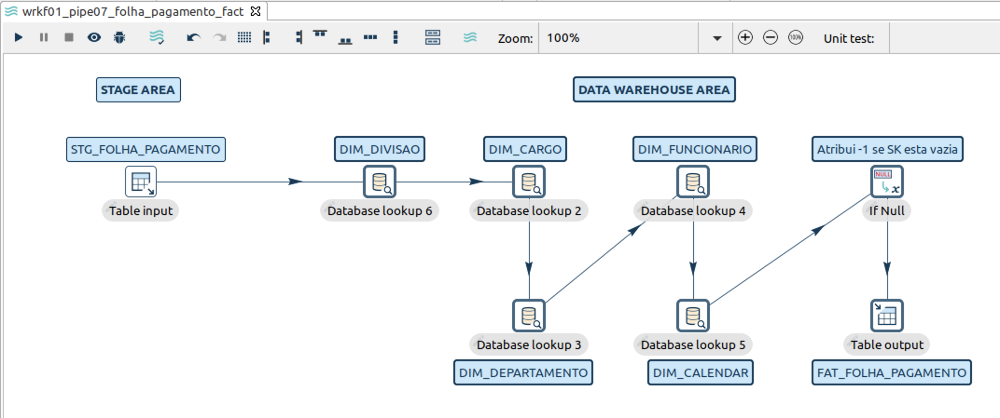

<div id="top"></div>
<!--
*** Thanks for checking out this README file.
*** If you have a suggestion, please fork the repo and create a pull request
*** or open an issue with the tag "enhancement".
*** Don't forget to give the project a star!
*** Thank you!
-->

<div align="center">
<h3 align="center">Projeto de Data Warehouse em Apache HOP - WIP README!</h3>
  <p align="center">
    Data Warehouse de Folha de Pagamento.
    <br />
    <a href="https://github.com/sergiosouzalima/apachehop-dw-salary-payments">
    <strong>Explore os documentos »</strong></a>
    <br />
    <br />
    <a href="https://github.com/sergiosouzalima/apachehop-dw-salary-payments/issues">Informe um Bug</a>
    ·
    <a href="https://github.com/sergiosouzalima/apachehop-dw-salary-payments/issues">Solicite uma Funcionalidade</a>
  </p>
</div>

<!-- TABLE OF CONTENTS -->
<details>
  <summary>Indice</summary>
  <ol>
    <li>
      <a href="#about-the-project">Sobre o Projeto</a>
      <ul>
        <li><a href="#how-it-works">Como funciona</a></li>
        <li><a href="#built-with">Construído com</a></li>
      </ul>
    </li>
    <li>
      <a href="#getting-started">Iniciando</a>
      <ul>
        <li><a href="#prerequisites">Pré-requisitos</a></li>
        <li><a href="#installation">Instalação</a></li>
      </ul>
    </li>
    <li><a href="#usage">Modo de Uso</a></li>
    <li><a href="#contributing">Contribuição</a></li>
    <li><a href="#license">Licença</a></li>
    <li><a href="#contact">Contato</a></li>
    <li><a href="#acknowledgments">Agradecimentos</a></li>
  </ol>
</details>

<!-- ABOUT THE PROJECT -->

<div id="about-the-project"></div>


## Sobre o Projeto

* Este é um simples projeto de um "Armazém de Dados" ou <a href="https://pt.wikipedia.org/wiki/Armazém_de_dados" target="_blank">Data Warehouse (DW)</a> feito com a ferramenta <a href="https://hop.apache.org" target="_blank">Apache HOP</a>.


<div id="how-it-works"></div>

## Como Funciona

- Na área de stage:
  - O projeto carrega arquivos <a href="https://pt.wikipedia.org/wiki/Comma-separated_values#:~:text=Os%20arquivos%20Comma-separated%20values,Excel%20e%20o%20LibreOffice%20Calc" target="_blank">CSV<a>, que contêm dados de funcionários, como nome, salário, departamento, divisão, etc. Para ver os arquivos CSV click <a href="https://github.com/sergiosouzalima/apachehop-dw-salary-payments/tree/master/datasets" target="_blank">aqui</a>
  - Depois, o projeto armazena os dados dos arquivos CSV, em tabelas da área de stage.(<a href="#stage-area">Stage Area</a>)
- Da área de stage para a área de DW:
  - Em seguida, o projeto move os dados da área de stage para dentro de tabelas de dimensão, que estão na área de DW.
  - A chamada "tabela fato", que está na área de DW, é alimentada com dados da folha de pagamento, como salário e data de pagamento.(<a href="#fact-table">Tabela Fato</a>)
- Na área de DW:
  - Na área do DW, o projeto cria a chamada "dimensão tempo". É uma tabela que armazena datas e serve para o DW fornecer dados com base em uma determinada data.(<a href="#calendar-dim">Dimensão Tempo</a>)
- E finalmente:
  - Depois de todos esses processos, o DW está pronto para ser consultado por outras ferramentas, gerando relatórios, gráficos, dashboards, etc.

<div id="built-with"></div>

### Construido com
* <a href="https://hop.apache.org" target="_blank">Apache HOP version 1.2.0</a>

<p align="right">(<a href="#top">voltar ao inicio</a>)</p>


<div id="stage-area"></div>

### Stage Area (carga dos arquivos CSV)

<br />
<div align="center">
  <a href="https://github.com/sergiosouzalima/apachehop-dw-salary-payments/blob/master/images/wrkf01_pipe01.png">
    
  </a>
</div>

<p align="right">(<a href="#top">voltar ao inicio</a>)</p>


<div id="calendar-dim"></div>

### Dimensão Tempo (Calendário)

<br />
<div align="center">
  <a href="https://github.com/sergiosouzalima/apachehop-dw-salary-payments/blob/master/images/wrkf01_pipe02.png">
    
  </a>
</div>

<p align="right">(<a href="#top">voltar ao inicio</a>)</p>

<div id="fact-table"></div>

### Tabela Fato

<br />
<div align="center">
  <a href="https://github.com/sergiosouzalima/apachehop-dw-salary-payments/blob/master/images/wrkf01_pipe07.png">
    
  </a>
</div>

<p align="right">(<a href="#top">voltar ao inicio</a>)</p>

<!-- GETTING STARTED -->
## Iniciando

Veja abaixo instruções para configurar e executar este projeto localmente.<br />

<div id="prerequisites"></div>

### Pré-requisitos

1. <a href="https://www.java.com/en/download/help/download_options.html" target="_blank">Java 11</a>.
2. <a href="https://www.postgresql.org" target="_blank">PostgreSQL</a>.

<div id="installation"></div>

### Instalação

1. <a href="https://hop.apache.org/manual/latest/getting-started/hop-download-install.html" target="_blank">Aqui</a>
 você encontra instruções para baixar e instalar o Apache HOP para Linux, MacOS ou Windows.

<p align="right">(<a href="#top">voltar ao inicio</a>)</p>

<!-- USAGE EXAMPLES -->

<div id="usage"></div>

## Modo de Uso.

Como este projeto pode ser usado.

1. Tenha o Apache HOP instalado localmente em sua maquina [<a href="#installation">Veja a sessão de instalação</a>]

2. Faça um clone deste repositorio
   ```sh
   git clone https://github.com/sergiosouzalima/apachehop-dw-salary-payments.git
   ```
3. Entre dentro da pasta criada no item anterior
   ```sh
   cd apachehop-dw-salary-payments
   ```
4. Execute o Apache HOP.
   ```sh
   ./hop-gui.sh
   ```
5. Dentro do Apache HOP, carregue o arquivo apachehop-dw-salary-payments/wrkf01_salary_payments.hwf

6. Click no botão "play" para executar este projeto.

<p align="right">(<a href="#top">voltar ao inicio</a>)</p>

<!-- CONTRIBUTING -->

<div id="contributing"></div>

## Contribuição

Contribuições são o que fazem a comunidade open source um ótimo lugar para aprender e criar.

Qualquer contribuição será **muito bem-vinda**.

Se você tem uma sugestão para melhorar este projeto, por favor, faça um fork do repositório e crie uma pull request.

Você pode também abrir uma <a href="https://github.com/sergiosouzalima/apachehop-dw-salary-payments/issues">issue</a> com a tag "enhancement" ou "melhoria".

Não se esqueça de marcar uma estrela neste projeto! Obrigado novamente!


1. Faça um Fork do projeto.
2. Crie sua Feature Branch (`git checkout -b feature/AmazingFeature`).
3. Commit suas mudanças (`git commit -m 'Add some AmazingFeature'`).
4. Envie para uma Branch (`git push origin feature/AmazingFeature`).
5. Abra uma Pull Request.

<p align="right">(<a href="#top">voltar ao inicio</a>)</p>

<!-- LICENSE -->

<div id="license"></div>

## Licença

Distribuido sob a Licença do MIT.

<p align="right">(<a href="#top">voltar ao inicio</a>)</p>

<!-- CONTACT -->

<div id="contact"></div>

## Contato

Sergio Lima - [@sergiosouzalima](https://twitter.com/sergiosouzalima) - sergiosouzalima@gmail.com

Este projeto no Github: [https://github.com/sergiosouzalima/apachehop-dw-salary-payments](https://github.com/sergiosouzalima/apachehop-dw-salary-payments)

<p align="right">(<a href="#top">voltar ao inicio</a>)</p>

<!-- ACKNOWLEDGMENTS -->

<div id="acknowledgments"></div>

## Agradecimentos

* [Apache Hop Brasil on Telegram](https://t.me/apachehop)
* [This README template by Othneil Drew](https://github.com/othneildrew/Best-README-Template)

<p align="right">(<a href="#top">voltar ao inicio</a>)</p>
